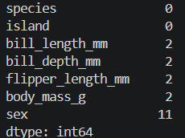
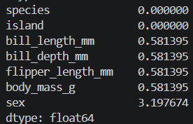
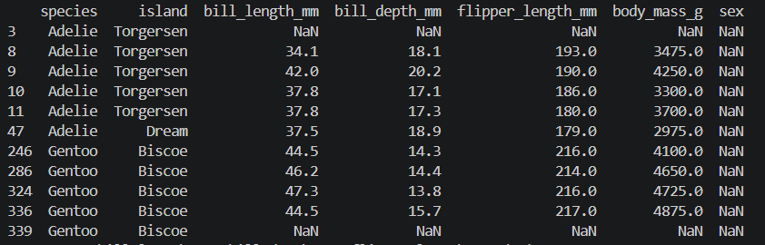
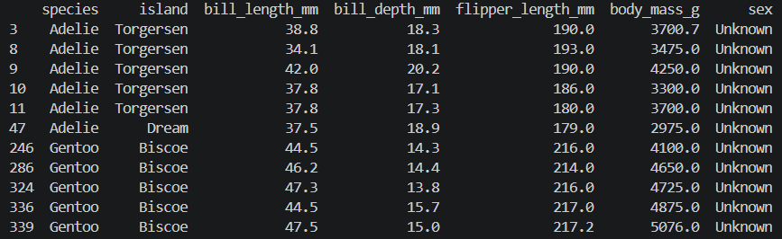
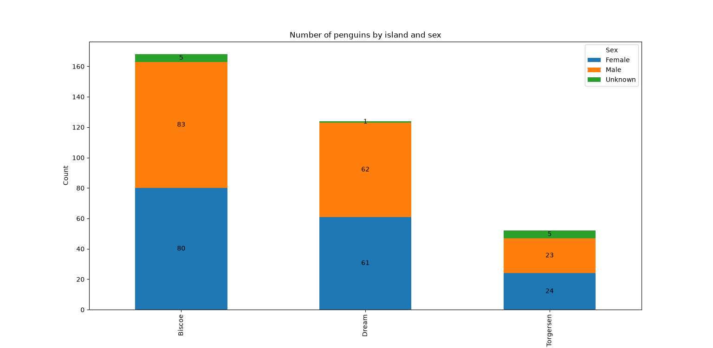
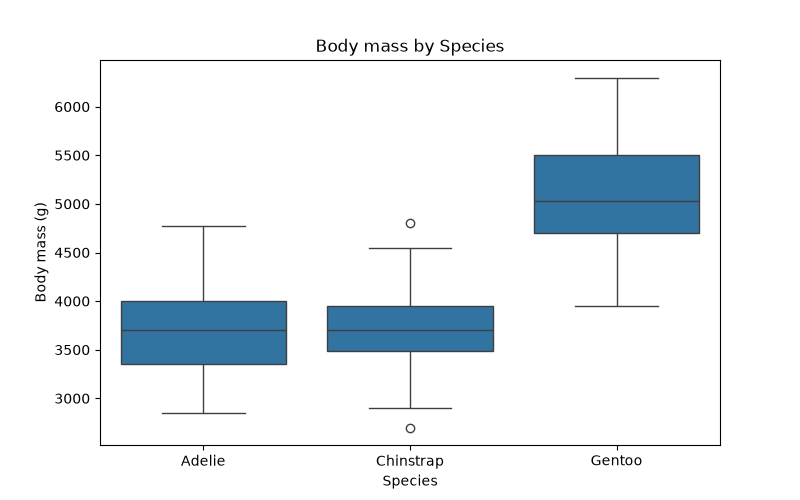
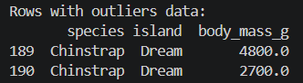

# data-analysis-in-python
A data analysis project using Python and Pandas, including exploratory analysis, data cleaning, and data visualization
The aim of analysis is to present the diversity of penguin sex found on the individual islands and to check for any outliers regarding weight grouped by species.

The analysis was based on data loaded using Seaborn in Python.

Added some comments to clarify steps I proceeded with. 
Please find attached the “analysis.py” file. The data consists of 344 rows and 7 columns. 
During data cleaning I noticed there are some missing data such as NaN. 
A decision had to be made on how to handle the missing data and to what extent this missing data could affect the analysis. 

Counted missing data:

## 

And checked the percentage:

## 

As we can see there are some NaN, as below:

## 

For columns: 
bill_length_mm
bill_depth_mm
flipper_length_mm
body_mass_g
used the average amounts according to what got for species.

For column:
sex
used “Unknown”

The result as below, NaN solved. Decided not to drop any rows.

## 

Also checked if there are any duplicates. In the analyzed Data Frame, no duplicates.

Please find below the answer for the first case regarding diversity of penguin sex found on the individual islands:

## 

Conclusion: The similar quantity of pinguins if we consider sex according to presented islands. Within each island, there are almost as many females as males.

Please find below the results for the second case, where I check for weight outliers grouped by species.

## 

Conclusion: As we can see, the highest weight has Gentoo Specie. In Chinstrap Specie we can see some outliers as below. There are two cases as below:

## 

